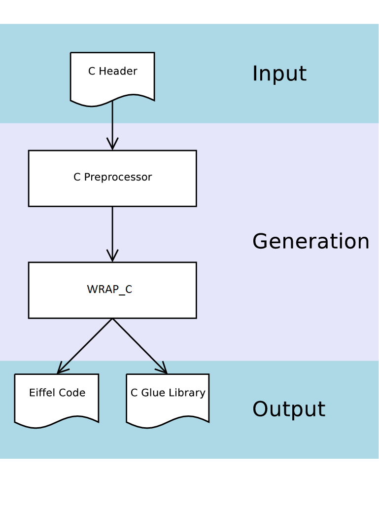

# Getting Started with WrapC

##### Table of Contents  
* [Installation](#installation)  


<a name="installation"></a>

# Installation

## Getting WrapC
https://github.com/eiffel-wrap-c/wrap_c

## Requirements

Library

*   [GOBO](https://github.com/gobo-eiffel/gobo). 19.03 or newer. (optional since it comes with EiffelStudio)

Compiler

*   [EiffelStudio](https://www.eiffel.org/downloads) 19.05 or newer

Platform

*   Everything supported by above requirements (At the moment only tested on Windows)

### Setting WrapC

The following describes actions that should be taken to properly setup `WrapC`.

Once you have `WrapC`tool installed , you should define the following environment variables in order to run `WrapC` wrapper generator


*   Set WRAP_C to the directory where you unpacked WrapC code.
*   Set GOBO_EIFFEL to ISE Eiffel compiler (ise).
*   Put ${WRAP_C}/bin into your ${PATH} environment variable

The following example shows a possible setup for windows:

	set WRAP_C=C:\wrap_c
	set PATH=%PATH%;%WRAP_C%\bin
	set GOBO_EIFFEL=ise
	set GOBO_CC=msc     

The following example shows a possible setup for linux:

	export WRAP_C=/home/aleitner/wrap_c
	export PATH=$PATH:$WRAP_C\bin
	export GOBO_EIFFEL=ise
	export GOBO_CC=gcc
      

#### Note
	You have to make sure that Eiffel compiler or C compiler gets used can be located via the PATH environment variable.

## Building the tools
 WrapC (the package) contains two tools:

    WRAP_C -- The Eiffel Wrapper Generator command line tool.
    escript -- An Eiffel application that helps to post process the generated code.

The source to those tools is located in ${WRAP_C}/src. When using a binary distribution (i.e. not the source distribution) there is no need to compile the tools, as they come already precompiled for your platform. 

### Compiling the Tools
The following will use the Gobo geant tool to setup and install the source code.

	cd ${WRAP_C}
	geant install
	geant compile

Another approach is to use the corresponding ecf’s and open them with EiffelStudio, (To be completed)

## Examples
 EWG comes with the following examples

	simple  -- A minimal example. This is a very good example to start with
	callback -- Demonstrates the use of C callbacks from within Eiffel
	template -- Template concept wrapper to start wrapping new libraries.
    
#### Note
In the future we will provide a little tool to create an empty project to help to create new wrappers.

For an up-to-date list of WrapC based wrapper libraries please visit the [WrapC Homepage organization](https://github.com/eiffel-wrap-c). 

### Building and Running the examples

This step requires that you already have compiled the wrap_c tool. If you have downloaded a release package for you platform, you are lucky, since these packages already come with the wrap_c tool pre-compiled.

You can find examples on how to use WRAP_C to create wrappers for C libraries in the directory ${WRAP_C}/example. These examples are fully functional, in that they include the necessary build automation to build the examples using Eiffel and C compilercombinations.

#### Build Automation Explained

`WrapC` uses Geant a build tool specifically tailored for the Eiffel programming language. 
To learn more about Geant check the following links
* 	[Overview of Geant](http://www.gobosoft.com/eiffel/gobo/geant/overview.html)
*  	[Geant Exaples](http://www.gobosoft.com/eiffel/gobo/geant/examples.html)

Available targets for `WrapC` libraries.

	geant
	usage:
	   geant install                -- Execute pre_process, install, post_process, c_build_library_ise
	   geant c_build_library_ise    -- Build C code
	   geant pre_process		-- User defined pre-process script. By default do nothing.	
	   geant process_wrap_c         -- Generate wrap_c wrappers for the target C library.
	   geant post_process		-- User defined post-process script. By default do nothing.
	   geant clean   		-- remove intermediary generated files
	   geant clobber 		-- remove all generated files

Most examples wrap a 3rd party C library. If you want to build such an example please read the Readme.md file in the examples directory. It is usually necessary for you to install certain development versions of the libraries to wrap. The Readme.md file gives details on what is necessary.

To generate the Eiffel wrapper for a given example go into the library subdirectory of the examples directory. The examples usually have two subdirectories. library contains the files necessary to build the wrapper and hello_world contains the source code for an actual Eiffel application that uses the wrapper. For example to generate the wrappers for the simple-example do:

	cd ${WRAP_C}/example/simple/library
	geant install
	
This will use the wrap_c tool to generate Eiffel and C files that make the c library accessible from within Eiffel. It may sound weird that C files are generated too, but it is unfortunately necessary. The generated C files will be compiled and put into a static link library.

To compile and run an example application go into the example applications directory. For example to build the hello_world application of the simple example do:

	cd ${WRAP_C}/example/simple/example/hello_world
	geant install
	geant compile
	./simple_hello_world
	
## Understanding WrapC

This section describes what code `WrapC` generates and how to integrate that code into a automated build system.

#### Command Line Options

The wrap_c tool is a command line application and takes the following command line parameters:

	wrap_c: You must specify '--cpp-full-header=<...>'
	usage: wrap_c   [--version] [--verbose]
		[--enable-msc-extensions | --disable-msc-extension] [--output-dir=<...>]
                --cpp-full-header=<...> [--include-header=<...>] [--config=<...>]
	

	options:
		--version ... Output EWG version number
		--verbose ... Output progress information on STDOUT
		--enable-msc-extensions ... Enable Visual C++ extensions (default on Windows)
		--disable-msc-extensions ... Disable Visual C++ extensions (default everywhere else :)
    
	arguments:
		--output-dir ... Directory where generated files will be placed
		--cpp-full-header ... File name (including path name) to the already c preprocessed C header
		--include-header ... Name of header file, that should be used in eiffel external clauses
		--config ... Name of config file to use. A config file allows to customize the wrapping process

You can use `wrap_c` directly to see what it produces on a header of your own without setting up a complete project, or use your own build process. Most of the time you will not use the `wrap_c` tool directly, but use it indirectly through geant.

<h3>The Generated Code</h3>

As shown in the next figure, `WRAP_C` takes an already preprocessed C header file and generates Eiffel classes and a C glue code library. The generation of the C glue code library, is needed for C callbacks, it might seem a little counter productive at first, since we really want to use Eiffel not C. But first of all this generated C code makes accessing the C library from Eiffel possible (at least for C callbacks) and second of all this generated C code is wrapped by the generated Eiffel classes as well, eliminating the need to deal with it directly.



<h2>**How to create your own Wrapper**</h2>

To generate a new Eiffel wrapper, the simplest way is to start from the template wrapping example located at {WRAP_C}/example/template

<h3>**Directory Structure**</h3>


	template	
		example        -- examples using the library 
		library        -- generated wrapper and the manual wrapping.
		test	       -- code to test the library
	        config.xml     -- configuration file to customize the way EWG generates the wrapper.
	        build.eant     -- build script
	        library.ecf    -- library configuration file.

### Updating the configuration file

```
<?xml version="1.0"?>
<ewg_config name="my_example">

<rule_list>
   <!-- This rule matches all C constructs who are named "foo". -->
   <!-- Matching constructs will be wrapped using WrapC s defaults -->

<rule>
  <match>
	 <identifier name="foo"/>
  </match>
  <wrapper type="default">
  </wrapper>
</rule>

  <!-- This rule matches all C constructs.         -->
  <!-- Matching constructs will be ignored.        -->
  <!-- Thus no wrapper will be generated for them  -->

<rule>
  <match>
  </match>
  <wrapper type="none">
  </wrapper>
</rule>

</rule_list>

</ewg_config>
```

