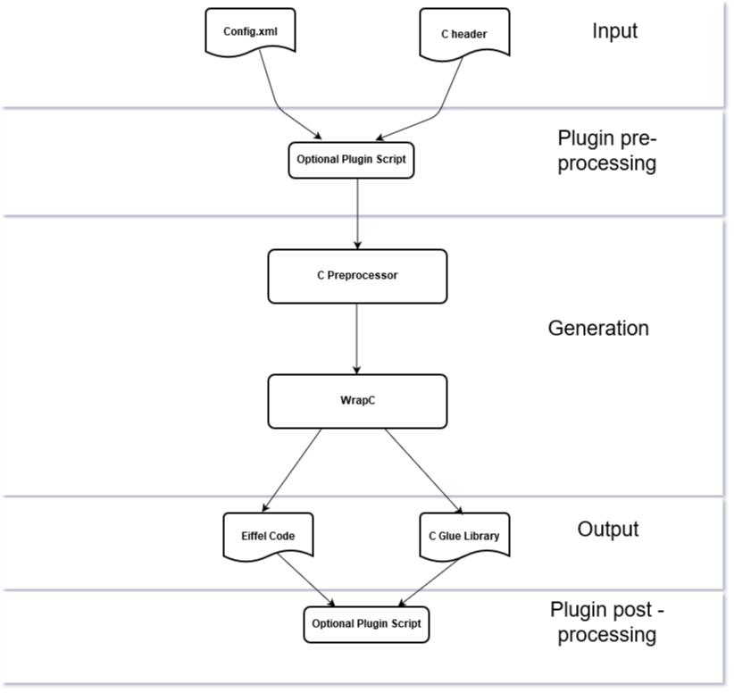

# Getting Started with WrapC

##### Table of Contents  
* [Install WrapC](#installation)
* [Understanding WrapC](#understanding_wrapc)
	*  [Command Line Options](#commands)
	*  [The Generated Code](#gencode)
	

<a name="installation"></a>
# Install WrapC
If you didn't install the tool, check the install section [here](./developer/Readme.md#installation)
	
<a name="understanding_wrapc"></a>
# Understanding WrapC

This section describes what code `WrapC` generates and how to integrate that code into a automated build system.

<a name="commands"></a>
## Command Line Options

The wrap_c tool is a command line application and takes the following command line parameters:

	wrap_c: You must specify '--full-header=<...>'
	usage: wrap_c   [--version] [--verbose]
                [--c_compile_options=<...>] [--script_pre_process=<...>] [--script_post_process=<...>]
		[--output-dir=<...>] --full-header=<...> [--config=<...>]

	options:
		--version ... Output WrapC (EWG) version number.
		--verbose ... Output progress information on STDOUT
		--c_compile_options: Optional c compile options
		--script_pre_process: Optional pre-processing script, to be executed before C header preprocessing
		--scrtip_post_process: Optional post-processing script, to be executed after Eiffel code wrapping.

	arguments:
		--output-dir  ... Directory where generated files will be placed
		--full-header ... Filename (including pathname) to the C header to be preprocessed, 
			          and name of header file, that should be used in eiffel external clauses
		--config      ... Name of config file to use. A config file allows to customize the wrapping process

You can use `wrap_c` directly to see what it produces on a header  of your own without setting up a complete project, or use your own build process. Most of the time you will not use the `wrap_c` tool directly, but use it indirectly through geant as an example.

## Example of use

### Simple example
	wrap_c --verbose --output-dir=C:/home/test/ewg/example/simple/library   full-header=C:/home/test/ewg/example/simple/library/manual_wrapper/c/include/simple_header.h --config=C:/home/test/ewg/example/simple/library/config.ewg

### Simple example with Post Processing Script
	wrap_c --verbose --output-dir=C:/home/test/ewg/example/simple/library --script_post_process= C:/home/test/ewg/example/simple/library/postscript.py  --full-header=C:/home/test/ewg/example/simple/library/manual_wrapper/c/include/simple_header.h  
	--config=C:/home/test/ewg/example/simple/library/config.ewg

<a name="gencode"></a>
## The Generated Code

As shown in the next figure, `WrapC` takes C header file which will be preprocessed and generates Eiffel classes and a C glue code library, based on the rules defined in the configuration `config.xml`. Optionally `WrapC`can use plugin scripts to do some pre processing, before to do the C preprocessing and Eiffel Code generation and after the code generation with the plugin post processing.  
The generation of the C glue code library, is needed for C callbacks, it might seem a little counter productive at first, since we really want to use Eiffel not C. But first of all this generated C code makes accessing the C library from Eiffel possible (at least for C callbacks) and second of all this generated C code is wrapped by the generated Eiffel classes as well, eliminating the need to deal with it directly.



<h2>**How to create your own Wrapper**</h2>

To generate a new Eiffel wrapper, the simplest way is to start from the template wrapping example located at {WRAP_C}/example/template

<h3>**Directory Structure**</h3>

	template	
		example        -- examples using the library 
		library        -- generated wrapper and the manual wrapping.
		test	       -- code to test the library
	        config.xml     -- configuration file to customize the way EWG generates the wrapper.
	        build.eant     -- build script
	        library.ecf    -- library configuration file.

### Updating the configuration file

```
<?xml version="1.0"?>
<ewg_config name="my_example">

<rule_list>
   <!-- This rule matches all C constructs who are named "foo". -->
   <!-- Matching constructs will be wrapped using WrapC s defaults -->

<rule>
  <match>
	 <identifier name="foo"/>
  </match>
  <wrapper type="default">
  </wrapper>
</rule>

  <!-- This rule matches all C constructs.         -->
  <!-- Matching constructs will be ignored.        -->
  <!-- Thus no wrapper will be generated for them  -->

<rule>
  <match>
  </match>
  <wrapper type="none">
  </wrapper>
</rule>

</rule_list>

</ewg_config>
```

