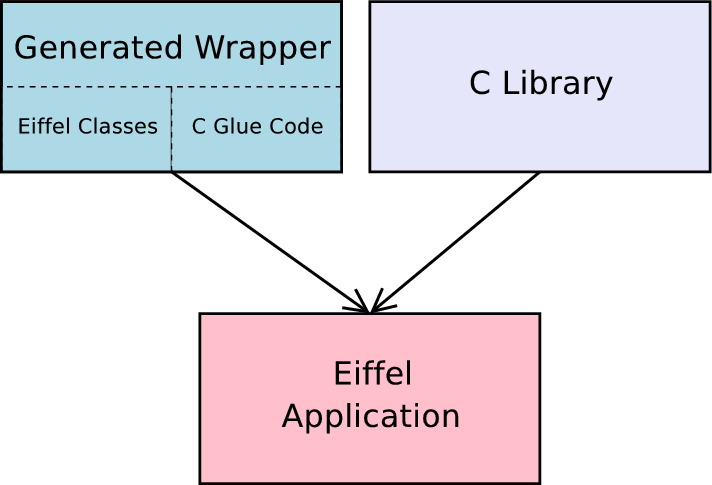

# Getting Started with WrapC

##### Table of Contents  
* [Install WrapC](#installation)
* [Understanding WrapC](#understanding_wrapc)
	*  [Command Line Options](#commands)
	*  [The Generated Code](#gencode)*  
	*  [Example of use](#tooluse)
* [Eiffel Generated Code](#eiffel_gen_code)
	*  [Enums](#enums)
	*  [Structs](#structs)  
	*  [Unions](#unions)
	*  [Functions](#functions)
	
	
	
	

<a name="installation"></a>
# Install WrapC
If you didn't install the tool, check the install section [here](./developer/Readme.md#installation)
	
<a name="understanding_wrapc"></a>
# Understanding WrapC

This section describes what code `WrapC` generates and how to integrate that code into a automated build system.

<a name="commands"></a>
## Command Line Options

The wrap_c tool is a command line application and takes the following command line parameters:

	wrap_c: You must specify '--full-header=<...>'
	usage: wrap_c   [--version] [--verbose]
                [--c_compile_options=<...>] [--script_pre_process=<...>] [--script_post_process=<...>]
		[--output-dir=<...>] --full-header=<...> [--config=<...>]

	options:
		--version ... Output WrapC (EWG) version number.
		--verbose ... Output progress information on STDOUT
		--c_compile_options: Optional c compile options
		--script_pre_process: Optional pre-processing script, to be executed before C header preprocessing
		--scrtip_post_process: Optional post-processing script, to be executed after Eiffel code wrapping.

	arguments:
		--output-dir  ... Directory where generated files will be placed
		--full-header ... Filename (including pathname) to the C header to be preprocessed, 
			          and name of header file, that should be used in eiffel external clauses
		--config      ... Name of config file to use. A config file allows to customize the wrapping process

You can use `wrap_c` directly to see what it produces on a header  of your own without setting up a complete project, or use your own build process. Most of the time you will not use the `wrap_c` tool directly, but use it indirectly through geant as an example.

<a name="tooluse"></a>
## Example of use

### Simple example
	wrap_c --verbose --output-dir=C:/home/test/ewg/example/simple/library   full-header=C:/home/test/ewg/example/simple/library/manual_wrapper/c/include/simple_header.h --config=C:/home/test/ewg/example/simple/library/config.ewg

### Simple example with Post Processing Script
	wrap_c --verbose --output-dir=C:/home/test/ewg/example/simple/library --script_post_process= C:/home/test/ewg/example/simple/library/postscript.py  --full-header=C:/home/test/ewg/example/simple/library/manual_wrapper/c/include/simple_header.h  
	--config=C:/home/test/ewg/example/simple/library/config.ewg

<a name="gencode"></a>
## The Generated Code

As shown in the next figure, `WrapC` takes C header file which will be preprocessed and generates Eiffel classes and a C glue code library, based on the rules defined in the configuration `config.xml`. Optionally `WrapC`can use plugin scripts to do some pre processing, before to do the C preprocessing and Eiffel Code generation and after the code generation with the plugin post processing.  
The generation of the C glue code library, is needed for C callbacks, it might seem a little counter productive at first, since we really want to use Eiffel not C. But first of all this generated C code makes accessing the C library from Eiffel possible (at least for C callbacks) and second of all this generated C code is wrapped by the generated Eiffel classes as well, eliminating the need to deal with it directly.


An application that uses the WrapC wrapper uses the generated Eiffel Classes optionally Manual wrapped code and links against the generated glue code library as well as to the C library. 



WrapC creates a whole directory structure containing generated source code.

The following shows the directory structure generated by WrapC

	generated_wrapper
		c 		-- C source code for c glue library (needed for callbacks).
			include -- C headers.
			src	-- C implementation.
		eiffel  -- Eiffel classes 

<a name="eiffel_gen_code"></a>
# Eiffel Generated Code
This sections describes what code gets generated for C enum, struct, unions, functions declarations and how to use them.

<a name="enums"></a>
## Enums

Here we describe what code gets generated for a C enum declaration and how to use that code.
Let us look at the following enum declaration (taken from the simple-example) defined in the header `simple_header.h`

    typedef enum
    {
    	red,
    	blue,
    	green
    } colors;
    	   
colors is an alias for an anonymous enum. WrapC generates an Eiffel wrapper class for it in the cluster `eiffel` :

	class COLORS_ENUM_API

	feature {ANY}

		is_valid_enum (a_value: INTEGER): BOOLEAN 
				-- Is `a_value' a valid integer code for this enum ?
			do
				Result := a_value = red or a_value = blue or a_value = green
			end

		red: INTEGER 
			external
				"C inline use <simple_header.h>"
			alias
				"red"
			end

		blue: INTEGER 
			external
				"C inline use <simple_header.h>"
			alias
				"blue"
			end

		green: INTEGER 
			external
				"C inline use <simple_header.h>"
			alias
				"green"
			end

	end
    	 

The name of the class is `COLORS_ENUM_API`. Since Eiffel does not have the enum concept, enums are mapped as INTEGER in Eiffel. Simply inherit from `COLORS_ENUM_API` wherever you want to use them or just use it as a client.

<a name="structs"></a>
## Structs

Here we describe what code gets generated for a C struct declaration and how to use that code to create, free, read from and write to a struct.

Let's look at the following struct declaration (taken from simple example) defined in the header `simple_header.h`

	struct foo
	{
	  int a,b,*pc;
	};

For structs `WrapC` generates a class with a low level layer using [inline externals](https://www.eiffel.org/doc/solutions/Interfacing_with_C_and_C%2B%2B#Inline_externals). 
The low level implementation are purely procedural but still provide full access to C structs. 
The high level access use the low level features to provide object oriented access. 
The high level access on the other hand provide an object oriented way to handle structs. 

	class FOO_STRUCT_API
	inherit

		MEMORY_STRUCTURE
	create

		make,
		make_by_pointer

	feature -- Measurement

		structure_size: INTEGER 
			do
				Result := sizeof_external
			end

	feature {ANY} -- Member Access

		a: INTEGER
				-- Access member `a`
			require
				exists: exists
			do
				Result := c_a (item)
			ensure
				result_correct: Result = c_a (item)
			end

		set_a (a_value: INTEGER) 
				-- Change the value of member `a` to `a_value`.
			require
				exists: exists
			do
				set_c_a (item, a_value)
			ensure
				a_set: a_value = a
			end

		b: INTEGER
				-- Access member `b`
			require
				exists: exists
			do
				Result := c_b (item)
			ensure
				result_correct: Result = c_b (item)
			end

		set_b (a_value: INTEGER) 
				-- Change the value of member `b` to `a_value`.
			require
				exists: exists
			do
				set_c_b (item, a_value)
			ensure
				b_set: a_value = b
			end

		pc: POINTER
				-- Access member `pc`
			require
				exists: exists
			do
				Result := c_pc (item)
			ensure
				result_correct: Result = c_pc (item)
			end

		set_pc (a_value: POINTER) 
				-- Change the value of member `pc` to `a_value`.
			require
				exists: exists
			do
				set_c_pc (item, a_value)
			ensure
				pc_set: a_value = pc
			end

	feature {NONE} -- Implementation wrapper for struct struct foo

		sizeof_external: INTEGER 
			external
				"C inline use <simple_header.h>"
			alias
				"sizeof(struct foo)"
			end

		c_a (an_item: POINTER): INTEGER
			require
				an_item_not_null: an_item /= default_pointer
			external
				"C inline use <simple_header.h>"
			alias
				"[
					((struct foo*)$an_item)->a
				]"
			end

		set_c_a (an_item: POINTER; a_value: INTEGER) 
			require
				an_item_not_null: an_item /= default_pointer
			external
				"C inline use <simple_header.h>"
			alias
				"[
					((struct foo*)$an_item)->a =  (int)$a_value
				]"
			ensure
				a_set: a_value = c_a (an_item)
			end

		c_b (an_item: POINTER): INTEGER
			require
				an_item_not_null: an_item /= default_pointer
			external
				"C inline use <simple_header.h>"
			alias
				"[
					((struct foo*)$an_item)->b
				]"
			end

		set_c_b (an_item: POINTER; a_value: INTEGER) 
			require
				an_item_not_null: an_item /= default_pointer
			external
				"C inline use <simple_header.h>"
			alias
				"[
					((struct foo*)$an_item)->b =  (int)$a_value
				]"
			ensure
				b_set: a_value = c_b (an_item)
			end

		c_pc (an_item: POINTER): POINTER
			require
				an_item_not_null: an_item /= default_pointer
			external
				"C inline use <simple_header.h>"
			alias
				"[
					((struct foo*)$an_item)->pc
				]"
			end

		set_c_pc (an_item: POINTER; a_value: POINTER) 
			require
				an_item_not_null: an_item /= default_pointer
			external
				"C inline use <simple_header.h>"
			alias
				"[
					((struct foo*)$an_item)->pc =  (int*)$a_value
				]"
			ensure
				pc_set: a_value = c_pc (an_item)
			end

	end
	
To use this wrappper just use it as a client or inherit from `FOO_STRUCT_API. The following code snippet demonstrates how to use the struct wrapper class

    		 
    example_struc_foo 
    	local
    		foo: FOO_STRUCT_API
			-- Wrapper object for `struct foo'
    	do
    			-- Create a new struct of type 'struct foo'
			-- `unshared' means that when `foo' will get
			-- collected, the struct it wrapps will be
			-- freed.
		create foo.make
		
 			-- Set members `a' and `b'.
			-- Note that `a' and `b' are real
			-- members of struct foo.
		foo.set_a (33)  -- (1) High level access: set struct member
		foo.set_b (75)   	 	
		
			-- Output the members
		print ("foo.a (33): " + foo.a.out + "%N")  -- (2) High level access: read struct member
		print ("foo.b (75): " + foo.b.out + "%N")
    	end
  
(1) In this case we use our high level access to the STRUCT_API that will use the low level implementation in this case the following code will be called form te feature `FOO_STRUCT_API.set_a`
 
	 set_c_a (an_item: POINTER; a_value: INTEGER) 
		require
			an_item_not_null: an_item /= default_pointer
		external
			"C inline use <simple_header.h>"
		alias
			"[
				((struct foo*)$an_item)->a =  (int)$a_value
			]"
		ensure
			a_set: a_value = c_a (an_item)
		end

(2) Similar to (1)  but to read a member value in this case `a`, the low level implmentation to be called from `FOO_STRUCT_API.a` 


	c_a (an_item: POINTER): INTEGER
		require
			an_item_not_null: an_item /= default_pointer
		external
			"C inline use <simple_header.h>"
		alias
			"[
				((struct foo*)$an_item)->a
			]"
		end


<h2>**How to create your own Wrapper**</h2>

To generate a new Eiffel wrapper, the simplest way is to start from the template wrapping example located at {WRAP_C}/example/template

<h3>**Directory Structure**</h3>

	template	
		example        -- examples using the library 
		library        -- generated wrapper and the manual wrapping.
		test	       -- code to test the library
	        config.xml     -- configuration file to customize the way EWG generates the wrapper.
	        build.eant     -- build script
	        library.ecf    -- library configuration file.

### Updating the configuration file

```
<?xml version="1.0"?>
<ewg_config name="my_example">

<rule_list>
   <!-- This rule matches all C constructs who are named "foo". -->
   <!-- Matching constructs will be wrapped using WrapC s defaults -->

<rule>
  <match>
	 <identifier name="foo"/>
  </match>
  <wrapper type="default">
  </wrapper>
</rule>

  <!-- This rule matches all C constructs.         -->
  <!-- Matching constructs will be ignored.        -->
  <!-- Thus no wrapper will be generated for them  -->

<rule>
  <match>
  </match>
  <wrapper type="none">
  </wrapper>
</rule>

</rule_list>

</ewg_config>
```

